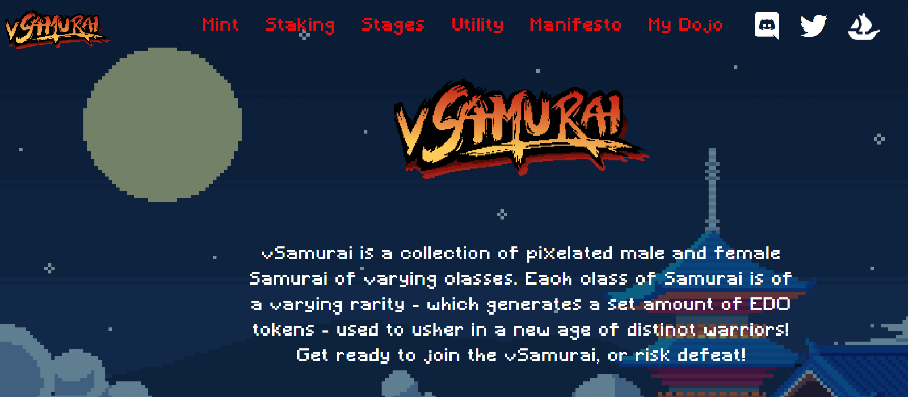
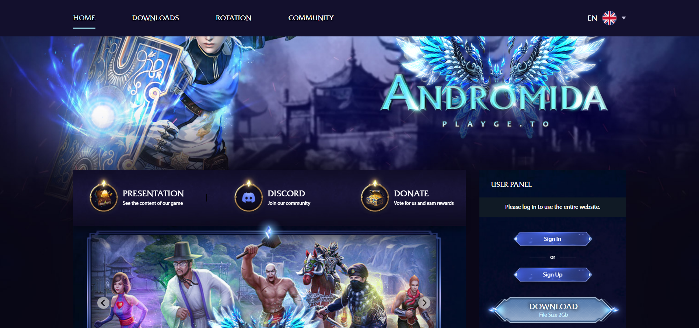
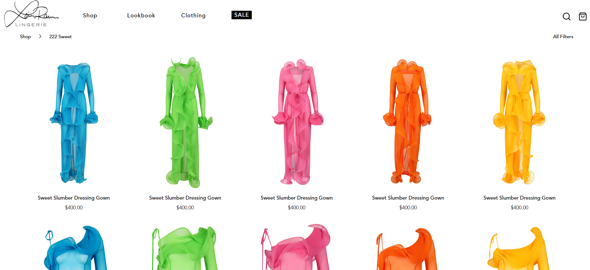

<h2 align="center">The Promised Technologies </h2>

#### Frontend Development
- React.js, Next.js
- Vue.js, Nuxt.js
- Angular
- HTML5, CSS, SCSS, TailwindCSS
- Material UI, Element UI, React Bootstrap, BootstrapVue, Quasar, Vuetify

#### Frontend Mobile development
- React Native, Ionic
- Bridge

#### JS libraries
- Axios, Moment, lodash, web3.js, d3.js, three.js

#### Backend Development
- Node.js, Express.js, Nest.js
- Python, Django, Flask
- Java, Spring Boot
- Authentication & Authorization (JWT, Oauth2), Authorized API, REST api, GraphQL, gRPC, Websocket

#### Database
- MySQL, MS SQL Server, PostgreSQL, MongoDB
- Redis, Memecached
- Elasticsearch, Apache Kafka

#### Blockchain Development
- Ethereum, Solana, Polygon, Tron, Wax
- Solidity, Rust, C++, Web 3, Remix, Truffle, Hardhat
- Creating fungible/non-fungible tokens with Standards (ERC20, ERC721, ERC1155, BEP20...), Crypto currency 
- NFT marketplace, NFT minting, DAO

#### Cloud Service Support
- Amazon Web Services (AWS)
- Microsoft Azure
- oogle Cloud Platform (GCP)
- Heroku, Digital Ocean, Plesk

#### Project Management
- Jira, Trello, Asana, ZenDesk
- Slack, Github, Bitbucket, Gitlab

<h2 align="center">Projects</h2> 
<table>  
  <!-- <tr>
    <td width="50%" valign="top">
      <h3 align="center">PetDog Complete Website</h3>
         
        
         
        
<strong>This is a website to buy PetDog online.</strong>

      

        <strong> Technologies used </strong>
         
        
        
        
      

      

        <strong> IDE used </strong>
         
        
      

      

          
    
  
      

    </td>
    <td width="50%" valign="top">
      <h3 align="center">vSamurai</h3>
         
      
         
        
<strong>This is a NFT minting site. </strong>

      

        <strong> Technologies used </strong>
         
        
        
        
      

      

        <strong> IDE used </strong>
         
        
      

      

          
  
  
      

    </td>
  </tr> -->
  <tr>
    <td width="50%" valign="top">
      <h3 align="center">Game Website</h3>
         
        
         
        
<strong>This is a game website online.</strong>

      

        <strong> Technologies used </strong>
         
        
        
        
        
        
      

      

        <strong> IDE used </strong>
         
        
      

      

          
  
  
      

    </td>
    <td width="50%" valign="top">
      <h3 align="center">E-commerce website</h3>
       
        
       
        
<strong>This is a website to buy lingerie online.</strong>

      

        <strong> Technologies used </strong>
         
        
        
        
        
        
      

      

        <strong> IDE used </strong>
         
        
      

      

  
  
      

    </td>
    </tr>
    <!-- <tr>
    <td width="50%" valign="top">
      <h3 align="center">Real Estate Website</h3>
         
        
         
        
<strong>This is angular boilerplate project.</strong>

      

        <strong> Technologies used </strong>
         
        
        
        
        
        
        
      

      

        <strong> IDE used </strong>
         
        
      

      

          
  
  
      

    </td>
    <td width="50%" valign="top">
      <h3 align="center">Interior Website</h3>
       
        
       
        
<strong>This is an interior design website.</strong>

      

        <strong> Technologies used </strong>
         
        
        
        
        
        
      

      

        <strong> IDE used </strong>
         
        
      

      

  
  
      

    </td>
    </tr> -->
   <!--  <tr>  
    <td width="50%" valign="top">
      <h3 align="center">UI Assignment</h3>
         
        
         
        
<strong>This is a UI Assignment.</strong>

      

        <strong> Technologies used </strong>
         
        
        
        
        
      

      

        <strong> IDE used </strong>
         
        
      

      

          
  
  
      

    </td>
    <td width="50%" valign="top">
      <h3 align="center">Calculator   Light/Dark</h3>
         
        
         
        
<strong>This is a calculator with a light/dark mode.</strong>

      

        <strong> Technologies used </strong>
         
        
        
        
      

      

        <strong> IDE used </strong>
         
        
      

      

          
  
  
      

    </td>
  </tr> -->
</table>
